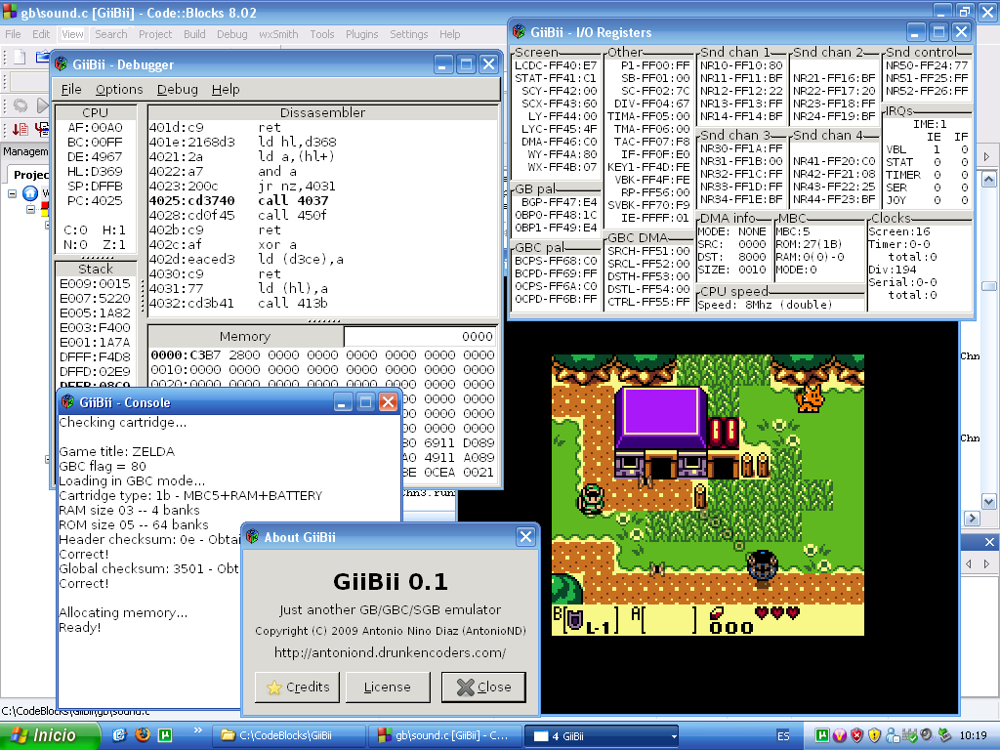

Well, this is the first "real" post. :P

I've been working on a port of GiiBii (my Game Boy emulator) to PC for about 3
weeks. It has been a bit difficult, as I used libraries that are only available
in Wii (libogc, asndlib...), and I wanted to make the port using only
cross-platform libraries (as I want to make Linux binaries).

The first thing I have to decide was the graphics library I could use in PC. I
decided that SDL was a good idea because it also gives a low-level sound API,
just what I need to improve the audio system of my emulator (yeah, the Wii
version uses a really bad system and there are glitches many times). When I
managed to get it to compile, I started porting the emulator. I deleted a lot of
code and, after commenting a lot of parts like sound, input, Super Game Boy
emulation, I managed to get it to compile. Then I started to fix that parts.
When I finished with the input and the SGB ones, I decided it was time to begin
with the GUI.

I looked for a library to make it. I found out that GTK+ was a good one, and I
started to put together GTK+ and SDL. When it was ready, I started to code the
GUI. GTK+ is a bit difficult at the beginning, but when you get used to it, you
can see that it's really useful. After a lot of hours of work, I finally made a
little menu with almost all options that you can see in the Wii binary and
rewrote the debugger.

This is the result:

Cool, isn't it? :)

I'm rewriting the sound emulation part at the moment. I think that in a week or
so I will have finished it (and some parts of the menu) and I will release a
beta.

Bye!
