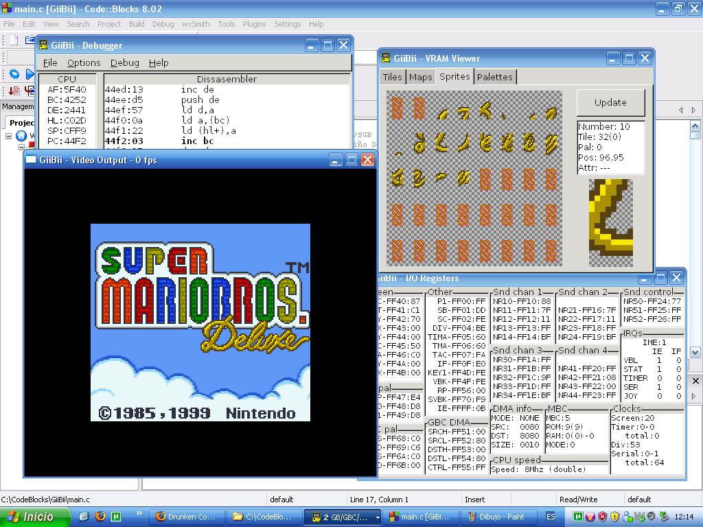

Well, it took me some days more to finish this because of some (sound related)
bugs I couldn't fix, but here it is! GiiBii v0.1, first version of GiiBii for
PC. I hope you like it. I think this is the first "official" release of an
emulator that supports the GBC boot ROM (not included in the downloads). :)

**Features**:

- Supports MBC1, MBC2, MBC3 (RTC emulated), MBC5, HuC-1.
- Sound channels emulated correctly (you can hear "Pikachu!" in Pokemon Yellow,
  for example).
- "Turbo" mode. Not extremely fast, though... This emulator is not meant to be
  fast, but to be accurate.
- Supports boot ROMs (bios). At the moment of writing this only DMG, SGB and CGB
  have been dumped, but GiiBii is prepared for the other ones as well (they may
  not work, as they haven't been tested).
- It can generate screenshots in PNG format.
- GB Printer emulated, images are saved into the screenshots folder in PNG
  format, too.
- Allows changing the screen palette in GB mode.
- Super Game Boy is emulated, though some commands aren't coded (sound, default
  palettes...).
- Debugger and VRAM viewer (debugger is not complete yet).
- Uses SDL and GTK+, cross platform libraries, so it should be very easy to
  port to Linux, for example (I'll check it and upload a binary when done).
- GiiBii is open source, it is licensed under the GPL v3 so you can modify it
  but you have to make modifications open source too.

And finally, the **downloads**:

[Binaries](/downloads/giibii_pc_v01_bin.rar)

[Source](/downloads/giibii_pc_v01_src.rar)
