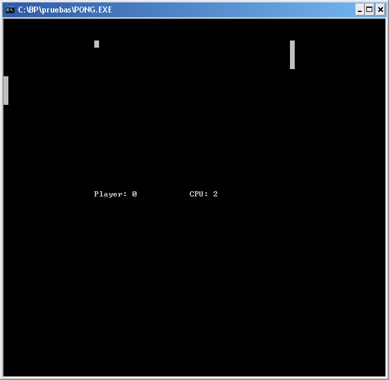

Well... This is what happens when I'm bored and I feel a bit guilty because I
haven't practised anything with pascal (they make us code with Turbo Pascal in
university)... I don't know exactly why I've put v0.1 as there won't probably be
more updates... :P Anyway, download links here, source + win32 binary:

[Download](/downloads/pascal_pong.rar)

And a screenshot...

