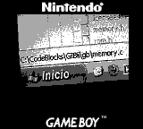

New version! This time, GiiBii comes with an interesting new feature... It can
emulate the GB Camera with camera features! I'll explain more about this later,
before that:

**Changes**:

- New mappers supported: MMM01 (Taito Variety Pack works, Momotarou Collection 2
  doesn't...), MBC7 (controls need some improvements...).
- You can set the screen size to 1x or 2x now.
- You can reset the ROM instead of having to exit it and reload the ROM.
- Now the console shows more information when loading a ROM (like the licensee
  name).
- You can set customized controls for 4 players (yeah, SGB multiplayer works
  again ^^).
- You can change volume or enable/disable each sound channel.
- Stop mode emulated correctly (but I've never seen any game using it, I've
  coded it just by testing on my GBC).
- Added breakpoint support.
- Debugger font size can be changed (take a look at the ini file).
- A few little bugfixes and improvements...

**Downloads**:

[Binaries (win32)](/downloads/giibii_pc_v02_bin.rar)

Binaries (Linux) -- coming soon... :)

[Source](/downloads/giibii_pc_v02_src.rar)

Very messy, camera functions in "memory.c" (nothing special, though).

**Game Boy Camera**:

This version of GiiBii can emulate camera features of GB Camera just by using a
webcam. For getting the pictures from it, GiiBii uses OpenCV, which is
cross-platform, just like SDL and GTK+. GiiBii will try to use as much
information as possible from the webcam, and scale it down to the GB size. This
is just the first version with camera support, you can expect some improvements
in next versions. For example, brightness is emulated very badly... but hey, it
"works". On the other hand, contrast doesn't work... What I'm trying to say is
that you will have to wait if you want a better support. Just remember that this
emulator isn't as fast as it could be, so don't expect it running as well as the
other emulators you've tried. Anyway, take a look at what it can do now :) :

Try taking a picture and "printing" it using GB Printer (which is emulated). :)

Just a note: It may freeze a second or so when loading the GB Camera ROM
(because of the webcam being initialized). If you want to enable the webcam
window, enable debug messages and it will load when opening the GB Camera ROM.
