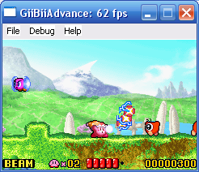
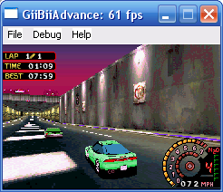
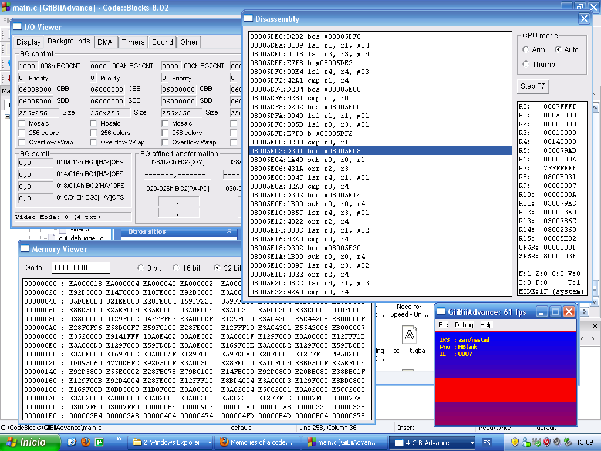

Hello!

Since GiiBii works really well for what I expected, I wanted to do a GBA
emulator. I've been working on it since July, and after 2 months of work, here
are some results:

"Kirby - Nightmare in Dream Land" and "Need For Speed - Underground 2".

Obviously, there is still a lot to do, most games are unplayable (in fact, NFS
runs very slowly, there is a problem with CPU timing, I guess), have graphic
glitches (where is the needle of the speedometer? :P) or just can't pass from
the initial splash screens (if they can show them...).

What is done:

- CPU emulation (ARM and THUMB), but it is still buggy.
- DMA channels (except special modes).
- All BG modes and regular (non-affine) sprites are emulated. No special effects
  or window effects, though.
- `VBL`, `HBL`, `VCOUNT`, `DMA` and `KEYPAD` interrupt requests.
- Disassembler, I/O register viewer (both aren't finished) and memory viewer.

A capture of the debugger:

Yeah, that's a Tonc demo.

PS: A new version of GiiBii is coming in a few days :P.
