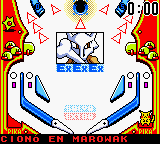
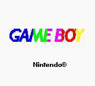
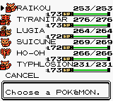
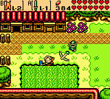
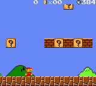

Special [Scenery Beta 2010](http://www.scenebeta.com/noticia/scenery-beta-2010-international-homebrew-showcase-rules)
version!

The most important change is that it now uses OpenGL instead of drawing directly
to the framebuffer, which makes it work a bit faster. I've also allowed to use
3x zoom because the screen size is no longer a problem.

**Changes**:

- Dissasembler fixes.
- Debugger screen now gets focus when reaching a breakpoint.
- Changed to OpenGL, allowed 3x zoom. Fullscreen mode is buggy, sometimes it
  crashes when returning to windowed mode... :S
- Rumble "emulated" (screen shakes a bit).
- MBC7 fixed (Kirby Tilt 'n' Tumble).
- Mapper code optimized a bit.
- Stat bug emulated (Legend of Zerd, Road Rash now work in non-color Game Boy
  modes).
- Game Boy Pocket screen is now white, you can only change the color of the
  normal Game Boy screen.
- Sound emulation code partially optimized. Also, it is more accurate now (and
  it can save the sound output to a wav file, but the code is disabled this
  version because it needs testing).
- CPU fixes: Zero flag for opcodes `RRA` / `RR A`, `RCLA` / `RCL A`, etc...
- Added a filter to make colors more "realistic". You can enable it in the menu,
  and you can also enable or disable the frame mix filter that comes with GiiBii
  since first version.
- Discovered why Alleyway didn't work: GB Printer was enabled.
- Fixed a bug in `ICON_EN` SGB command that made graphics have serious glitches
  in some games (DK2, DK3).

**Downloads**:

[Binaries (win32)](/downloads/giibii_pc_v03_bin_windows.rar)

[Binaries (Linux)](/downloads/giibii_pc_v03_bin_linux.rar)

You need SDL and GTK+ (and OpenCV for the GB Camera).

[Source](/downloads/giibii_pc_v03_src.rar)

**Notes**:

- Emulation may be more accurate if you put the GB boot roms in the "boot"
  folder of the emulator (see the readme.txt). They aren't included with the
  download.
- You can load a ROM by grabbing it to the GiiBii exe file (or using
  the command line "GiiBii myrom.gb").
- If you want free ROMs, go to [PDRoms](http://www.pdroms.de/files/gameboy/).
  If you are looking for commercial games, I can't help you.
- This emulator will be mixed someday with GiiBiiAdvance.

**Screenshots**:

