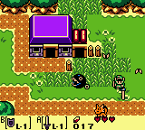
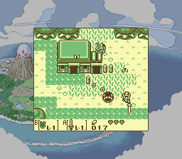
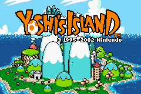
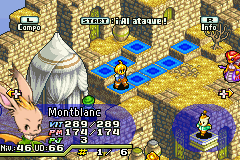
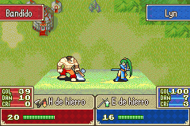
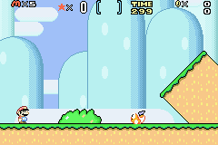
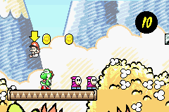

Special [Scenery Beta 2011](http://www.scenebeta.com/noticia/scenery-beta-2011-international-homebrew-showcase)
edition.

This is what I've been working on since last summer, and I think it is a quite
good program right now. It is just another GBA emulator, just like
[VisualBoyAdvance](http://vba.ngemu.com), and it emulates the same: GB, GBC,
SGB and GBA.

I've used the GB, GBC and SGB emulation code from GiiBii, so GiiBiiAdvance has
the same compatibility (a bit more, I've changed a bit of SGB emulation code).
GBA emulation is, on the other hand, not really high. I mean, lots of ROMs work,
but some of them just show a black screen, or hang when you try to start the
game from the menu... Everything of GBA is emulated (except the serial port),
but there are bugs I can't find, I'll work on it until I get a better
compatibility. Of course, it emulates all save chips, but some saves aren't
compatible with other emulators. It will try to guess the save type if it can't
detect it from the ROM. It lets you take screenshots, and GB Printer output is
saved as a png image. GB Camera is not emulated yet, though, so if you want to
play with that ROM, use GiiBii.

There is also a quite good debugger, with a disassembler, memory viewer, I/O
ports viewer, tile viewer, map viewer, palette viewer and sprite viewer. They
are different in GBx and GBA mode. If you are playing a SGB game, there is also
a SGB things viewer. I have to make it easy to dump/save things, right now it
only lets you watch. So... here are some screens:

**GBA mode**

- [GBA Disassembler](./giibiiadvance-v0-1-0-gba-dis.png)
- [GBA Memory viewer](./giibiiadvance-v0-1-0-gba-mem.png)
- [GBA I/O viewer](./giibiiadvance-v0-1-0-gba-io.png)
- [GBA VRAM viewer](./giibiiadvance-v0-1-0-gba-vram.png)

**GBC mode**

- [GBC Disassembler](./giibiiadvance-v0-1-0-gbc-dis.png)
- [GBC Memory viewer](./giibiiadvance-v0-1-0-gbc-mem.png)
- [GBC I/O viewer](./giibiiadvance-v0-1-0-gbc-io.png)
- [GBC VRAM viewer](./giibiiadvance-v0-1-0-gbc-vram.png)

**SGB mode**

- [SGB viewer](./giibiiadvance-v0-1-0-sgb-view.png)

And the **downloads**:

[Binary (windows only)](/downloads/giibiiadvance_010_bin.rar)

[Source](/downloads/giibiiadvance_010_src.rar)

So... that's it. I hope this program is useful for somebody. About the splash
screen... You can close it by clicking it, or just waiting 4 seconds. It is
disabled in the source code.

Oh, the last thing. If you want real SGB emulation, try [bsnes](http://byuu.org/bsnes).
It's an impressive SNES emulator, and lets you load and use a Game Boy ROM with
Super Game Boy ROM.

A few more screenshots in GBA mode:

Bye!
