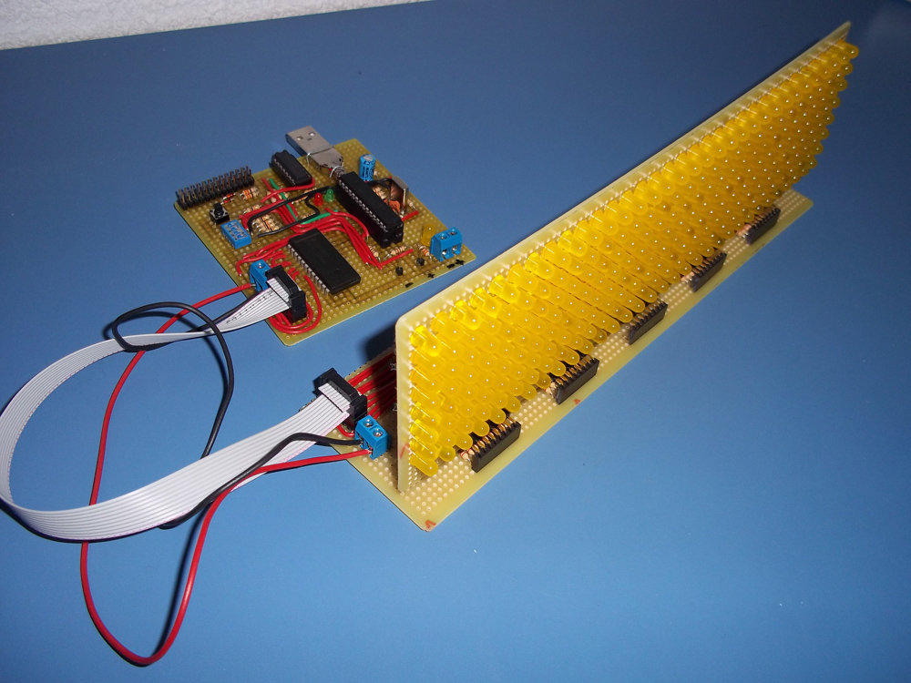
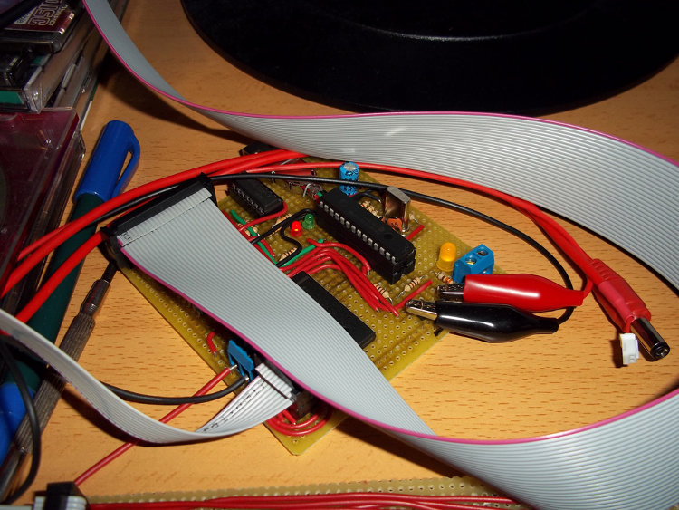
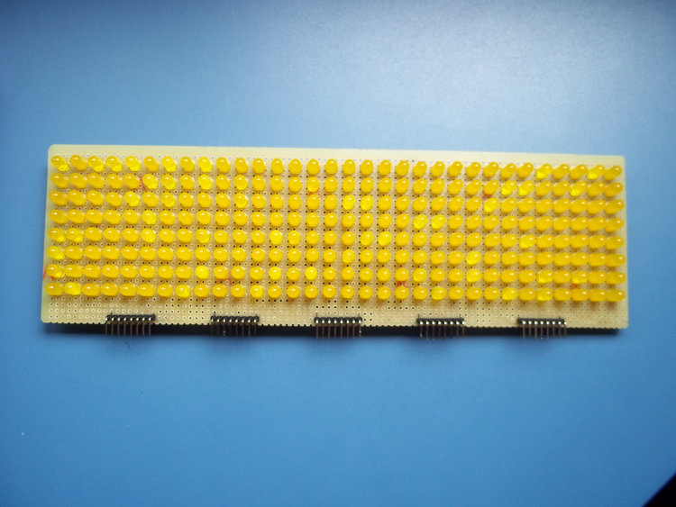
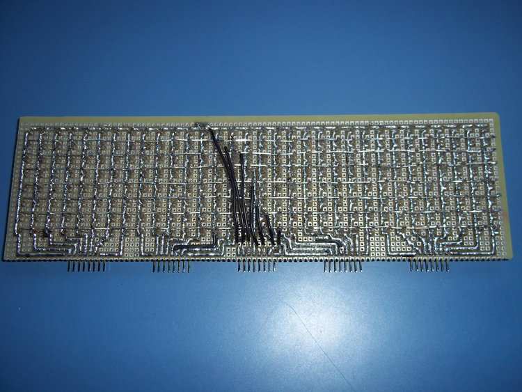
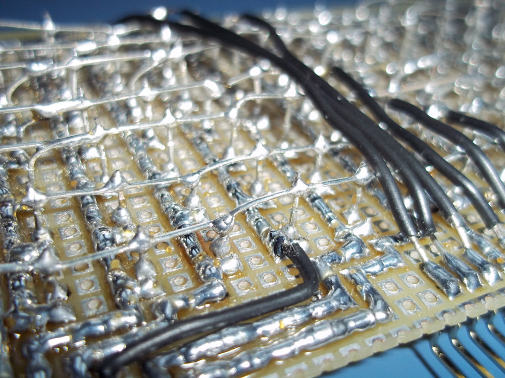
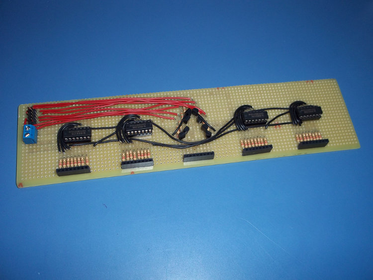
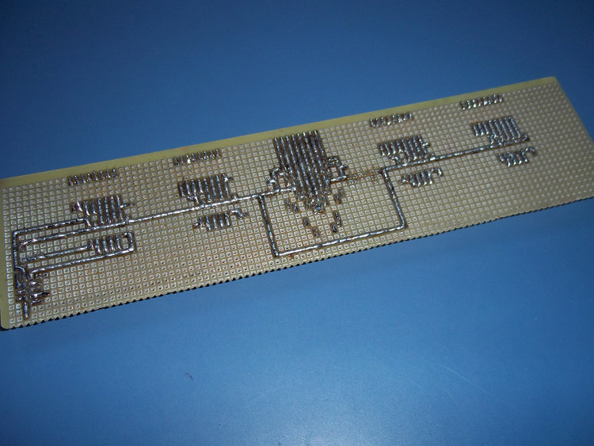
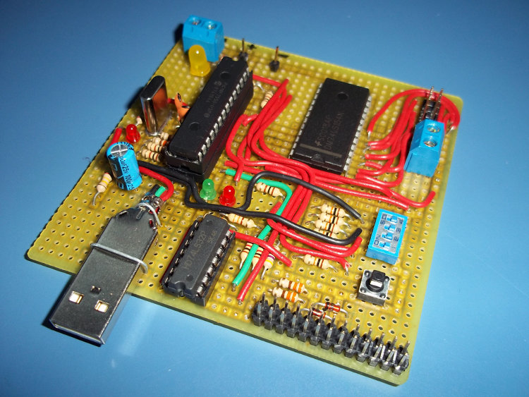
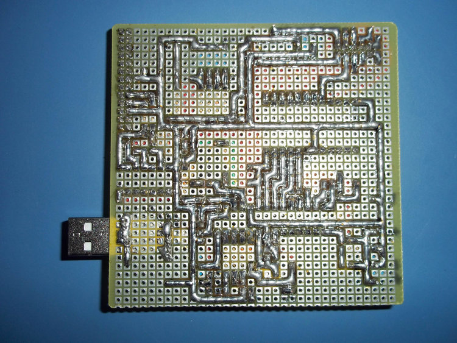

Hello!

I've been messing around with electronics lately (after all, that's what I'm
studying :P), and this is the result! A 32x8 LED Matrix controlled by a
PIC18F2550. You can click in the pictures for full size! At the end of the post
there is a video of the screen running.

It can show any image you want, and the microcontroller can hold more than 900
of them! You can set individual times for displaying each frame. Apart from
that, you can connect it to a UART port and stream data directly from the
computer. The UART connector is the 2x13 pin connector, but only 3 pin are
soldered. I did it this way because it is easier to connect it to the Raspberry
Pi without making errors.

I've used the 18F2550 because I had a few of them at home, and I want to make a
driver for streaming using USB instead of UART. It is running at 20MHz from an
external crystal oscillator.

Connected to the Raspberry Pi and power:

Now, some pictures of the boards. First, the simple (but a REAL pain to
solder, it took about 6 hours) 32x8 **LED board**:

A detail of the soldering:

Now, the **expansion board**. It basically holds some 74HCT164 (SIPO registers),
some transistors and resistors.

Last, but not least, the **control board**, which holds the microcontroller (a
PIC18F2550), a decoder, and a buffer. The decoder is 4:16, it should be 3:8 but
I didn't have one of them at home (well, I had one but not negative logic). The
buffer is actually a quad 2-input OR gate chip, I didn't have one buffer either,
and I needed it to convert voltage levels for the Raspberry Pi. Anyway, using
the 4:16 decoder was not a terrible idea because I soldered the 4 inputs to the
PIC and I can use the most significant one to turn off and on the screen (I
could have used the enable pin, but hey...). The button is just the reset
button, and the 4 DIP switches are connected to the PIC, but only the left one
is used for now (for switching between UART streaming and automatic mode). The
USB is not used for now.

The yellow LED is just a power indicator, the red and green ones are TX/RX
indicators, and the other red led is unused for now (it lights if there is a USB
cable connected at power up). And yeah, the PIC is in a socket in another
socket, just to make it really easy to remove it from the board. :P

And here it is, a [video of the display running](http://www.youtube.com/watch?v=-Fc5kiTPeHQ).
I can't embed the video here.

The software at the PC side is shown in the video, but it is basically a 32x8
matrix you can edit with the mouse and keyboard. You can also type a text and
the program will convert it to an animation! There are some things missing, like
error checking and sending again the data if the microcontroler says the packet
is corrupted. It is coded in C with SDL, using software rendering because the
Raspberry Pi version of SDL doesn't have OpenGL support.

If someone asks I could make schematics and upload them, and the code (in
assembly) for the PIC too, but there are a lot of tutorials for making LED
Matrix screens so I think it's not necessary.
