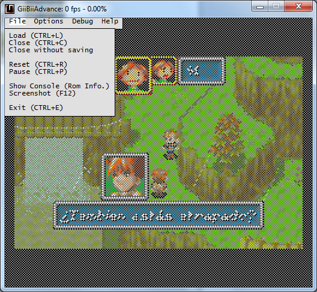
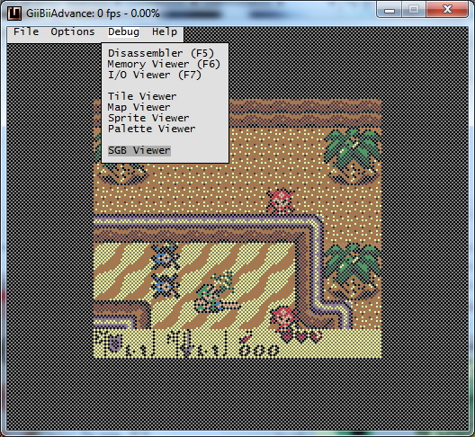
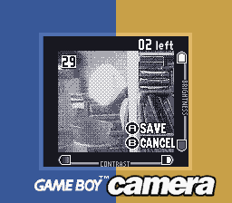
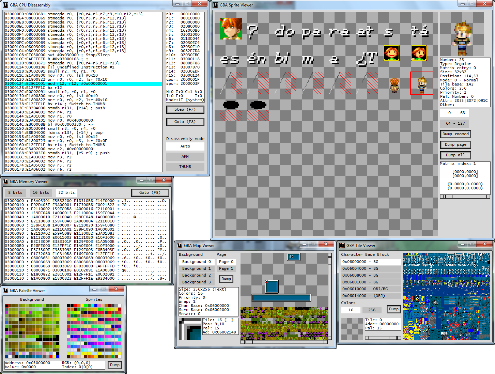
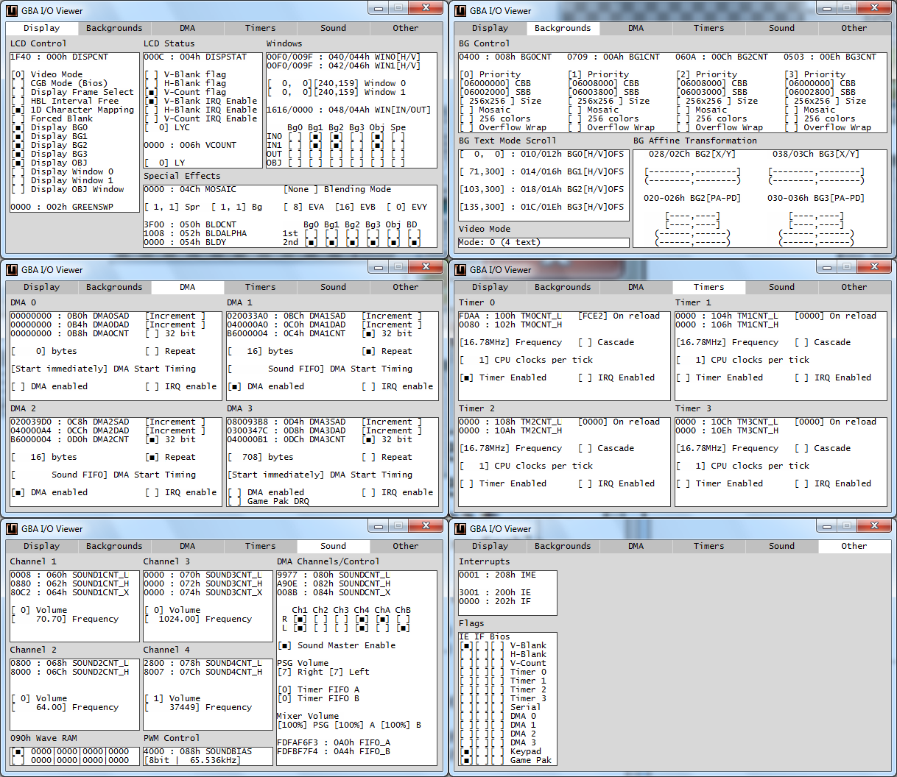
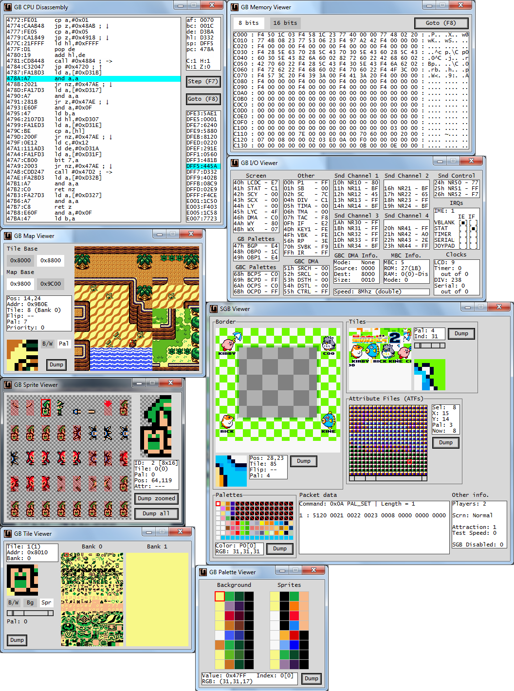

Hello!

After a few years, at last I continue with this emulator. :P I've been coding
for a few weeks and at last I have a release.

The main change is that it now uses SDL2 for the GUI, not WinAPI. It can compile
under Windows or Linux with the included Code::Blocks project file (I want to
add a Makefile later). You can check the source code here:

https://codeberg.org/SkyLyrac/giibiiadvance

Some screen captures:

This time I've included GB Camera emulation again. In GiiBiiAdvance
0.1.0 was removed (GiiBii had it). This time I've documented it all, and
I'm planning on doing some reverse engineering on the real hardware
(I've bought a few cartridges just in case I break one). For now, I've
only used the GB Camera software to see how it works, and I've managed
to emulate almost everything (contrast, dithering and brightness). It is
quite complicated to do emulate brightness because it depends on the
webcam and on the GB Camera software, so it changes weirdly sometimes.
The documentation is in "/docs/" folder in GitHub.

Of course, there is a debugger. I've improved it since 0.1.0, and now it
allows to dump any image that it displays. There are more changes, see
the changelog in the source code if you are interested.

The binaries are here. There are binaries for Windows and Linux
Mint/Ubuntu, with and without webcam support:

https://codeberg.org/SkyLyrac/giibiiadvance/releases

I hope you like it!

**Update (2026-01-14)**

Updated links from GitHub to Codeberg.
