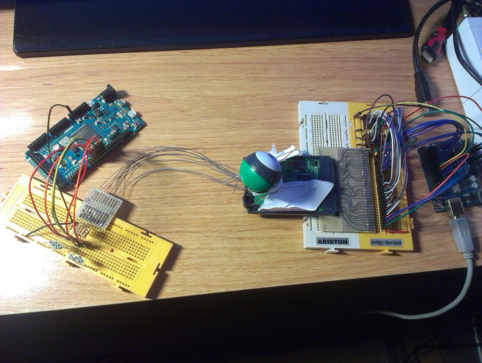

Over the last few weeks I've been doing some reverse engineering on the GB
Camera and I think I've documented it good enough for most things. I've reversed
the cartridge controller registers and measured the capture timings. The only
thing that I can't understand is the level/gain control of the sensor (its
datasheet is really bad) but it shouldn't matter for an emulator. I've
implemented this in [GiiBiiAdvance](https://codeberg.org/SkyLyrac/giibiiadvance)
and it's working perfectly (you'll have to wait for the next version if you want
to check it, though), so I guess that's all that matters.

And a pic of my hardware setup (click to zoom):

The repository is here: https://codeberg.org/SkyLyrac/gbcam-rev-engineer

The first release is here:

https://codeberg.org/SkyLyrac/gbcam-rev-engineer/releases/tag/v1.0

PS: Did I mention before that I won the GBdev 2014 compo?

http://gbdev.gg8.se/forums/viewtopic.php?id=244

**Update (2026-01-14)**

Updated links from GitHub to Codeberg.
