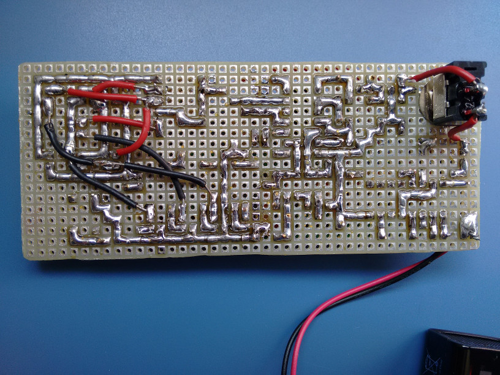
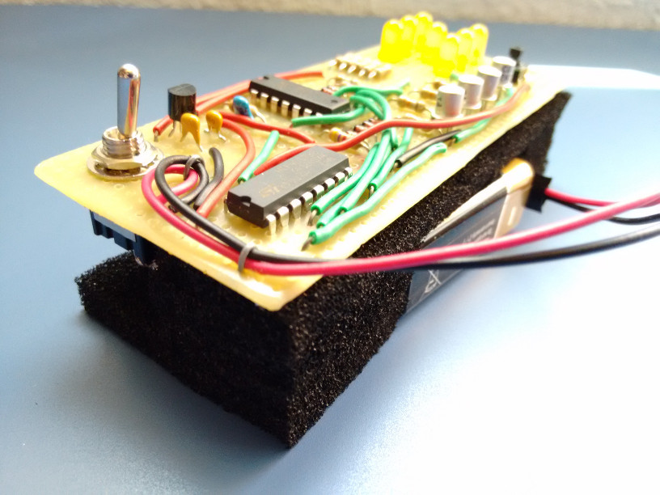
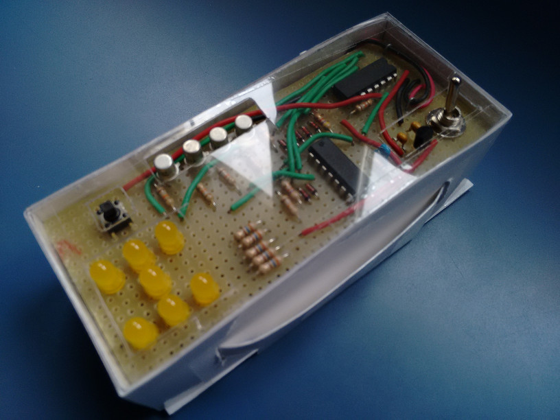
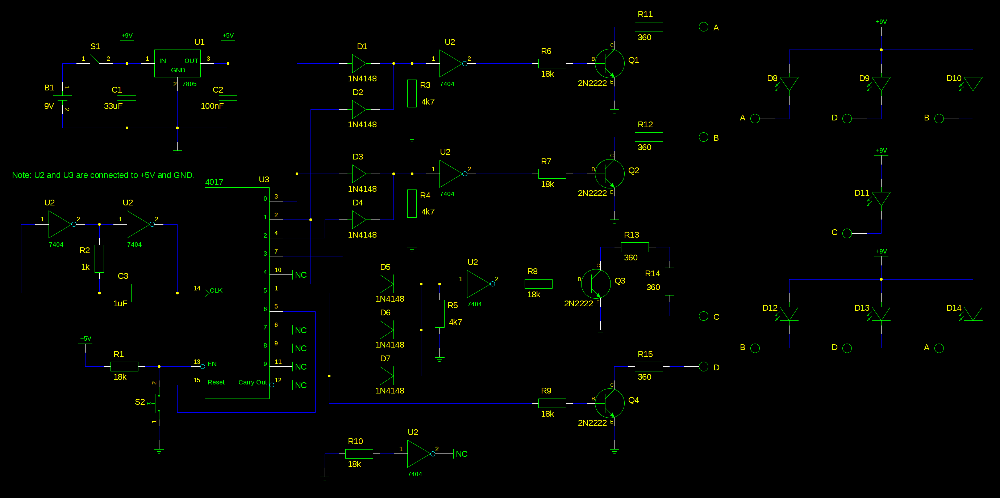

Well, after a few weeks not doing almost anything I've decided to post the last
useless device I've made. It's a simple electronic dice using a decade counter
and some inverters (used for logic and as oscillator). I decided not to use a
microcontroller because it felt like it was cheating for a circuit this
simple... There's not much to say: pressing the button will enable the counter
and releasing the button will stop it and show a "random" number. The counter is
very fast so it's impossible to guess what number is going to show when the
button is released. Here are a few pictures:

I used foam to hold the board and the battery in place so that it could be put
into a handmade box.

And, at last, a video of the circuit working:

https://www.youtube.com/watch?v=t7blrTmsfKg

While it's a really simple circuit to design and make, I've decided to create
schematics in case someone wants to make this:

Almost all components are specified in the schematic. The ones that aren't
completely specified are the voltage regulator (78L05), the inverter IC (74LS04)
and the decade counter (HFC4017).

There are two interesting things about this circuit, and the reason of both of
them is that I didn't want to buy many components, so I decided to use whatever
I had at home:

- The first one is that the oscillator is made of two inverters (and a capacitor
  and resistor). The values I've used for R and C make it oscillate at 390Hz
  approximately.

- The second one is that I don't use an IC with OR gates. I've decided to use
  some diodes and resistors to create them
  (https://en.wikipedia.org/wiki/Diode_logic).

The circuit uses a 9 V battery. The logic of the circuit needs about 11 mA, and
the LEDs need around 9 mA each. That means it uses from 20 mA (when only 1 LED
is on) to 65 mA (when 6 LEDs are on). The 7 LEDs can't be turned on at the same
time, obviously.
