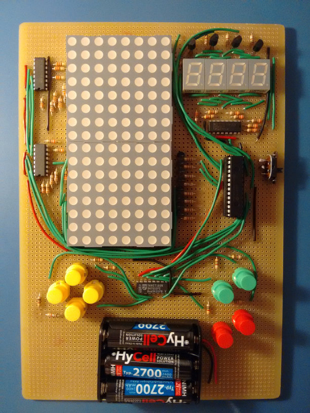
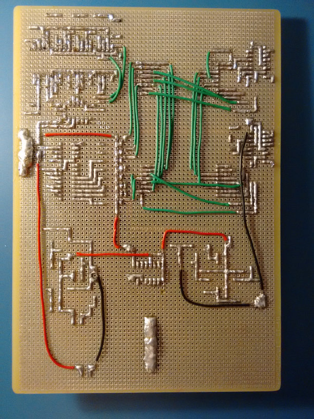
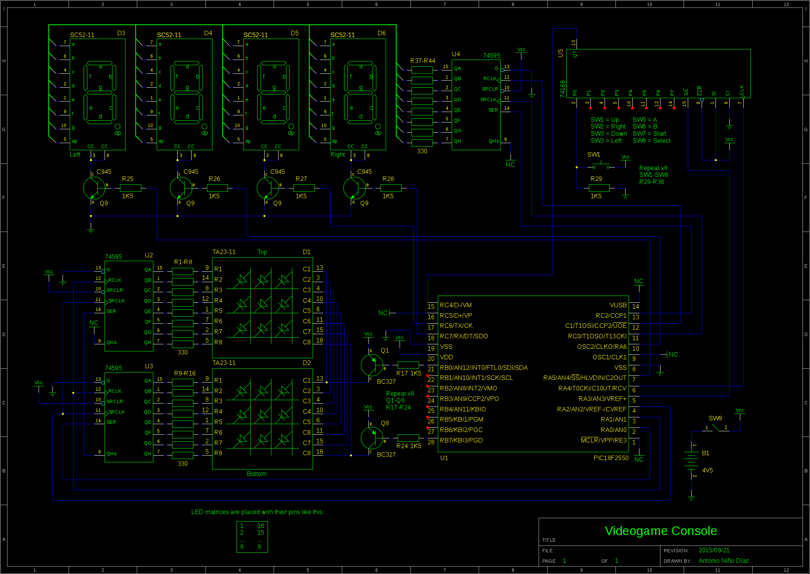
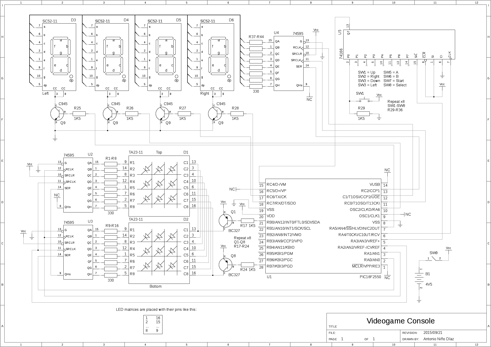

Hello again!

This time I'm writing to show you my newest electronic creation: a "videogame
console" made with a **PIC18F2550** as its brain. It has a 8x16 LED matrix as
main display and 4 seven segment displays to show the player score, for example.
It has 8 buttons (4 in a pad, the rest like a Game Boy or similar). The PIC
doesn't have enough pins to control everything easily, so I've used a few
74HC595 to control the LED matrix and the seven segment displays, and a 74HC166
to read the state of all buttons.

The game I've decided to code for the demonstration is a simple Tetris, written
in 100% assembly. YouTube **video** here:

https://www.youtube.com/watch?v=5fmSbreJsDI

**Buttons**:

- Move left/right.

- Rotate clockwise/counterclockwise.

- Go down quickly, go down instantly.

- Pause, reset.

At the moment I haven't decided if I should post the schematics and the source
code for various reasons:

- I used different systems to power the LED matrix and the seven segment
  displays. A decent design should use the same system.

- Some resistors are too high and the LEDs, when lit, are too dim. I didn't
  consider the scanline refresh when calculating the resistors, so the actual
  intensity is a lot lower than I thought.

- The source code of the game is a bit messy (the "drivers" code is good,
  though).

Well, I hope you like it!

**EDIT**: Well, whatever, I'll just put the schematics and the code... :P

**Schematics**

**Code**

Don't expect it to be clean and/or human readable. The file 'main.asm' contains
the 'drivers', and 'tetris.asm' contains the game. It's fairly easy to modify it
to change some of the pin assignments.

**Download (gEDA schematics + assembly code + assembled .hex file)**

New version (2015/10/06), with a small modification to prevent "ghosting"
between displays when performing the scanline change. Also fixed a bug that
didn't remove completed lines before checking if game over.

[Download](/downloads/tetris_pic_20151006.tar.gz)

**Possible improvements**

- Change pull-down resistors for the buttons (R29-R36) by 10K resistors.

- Change LED resistors (330 Ohm) by 300 or maybe 220 resistors (R1-R16 and
  R37-R44).

- Make the LED matrix and the seven segment displays work the same way (changing
  the displays by common-anode equivalents and the transistors used to drive
  them).
