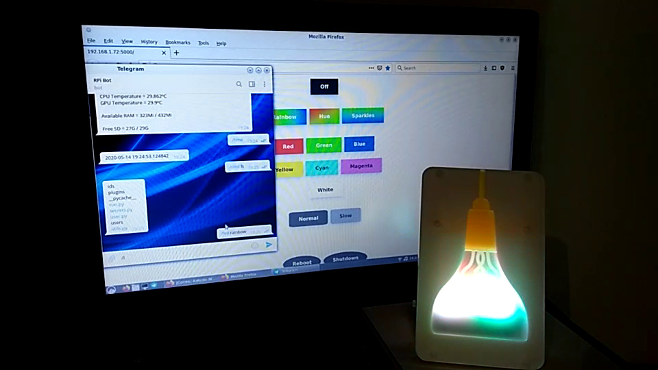

A few months ago (before the lockdown started) I was shopping at the Cambridge
city center, I popped by the [Raspberry Pi Store](https://www.raspberrypi.org/raspberry-pi-store/)
and I saw something called [Mood Light - Pi Zero W Project Kit](https://shop.pimoroni.com/products/mood-light-pi-zero-w-project-kit). This is basically a kit that contains:

- [Raspberry Pi Zero W](https://www.raspberrypi.org/products/raspberry-pi-zero-w/):
  Pretty nice, as it has integrated WiFI.
- [Unicorn HAT](https://github.com/pimoroni/unicorn-hat): 32x4 RGB LED matrix
  with a pretty simple Python library to control it.
- A plastic case to put everything in, for decoration.

I thought it looked pretty nice, and decided to buy it to play with it during
when the lockdown started.

I wrote a [Telegram](https://telegram.org/) bot a couple of years ago with
[Telepot](https://github.com/nickoala/telepot), and I thought that it would be
a good idea to repurpose it to control the lamp remotely. However, that was
only supposed to be the first step. Nobody really wants to have to type a
command to change the color of the lights, right? Also, it looks like that
Telepot has been deprecated, so it's likely going to break at some point in the
future.

The actual objective was to create a web user interface with
[Flask](https://flask.palletsprojects.com/), expose it to my home network, and
to be able to control the lights pressing buttons in a website from my phone,
PC, and even let any guest that come to my home control the lights by
connecting to the WiFi network.

This is a video of the result (it's missing one effect that simulates fire,
though):

https://www.youtube.com/watch?v=xjQCvFdkGJw

How does it work?
=================

There are 3 main parts:

- **LED server**: Script that has to be run with root permissions. It listens to
  connections to a specific port and affects the LEDs. It can also reboot or
  shutdown your Raspberry Pi.

- **Telegram bot**: Telegram bot that runs with regular user permissions. It can
  send commands to the LED server.

- **HTML server**: HTML server that sets up a website with some buttons that can
  be used to control the LEDs. It sends commands to the LED server.

Note that you don't need the Telegram bot and HTML server at the same time. Just
one is enough. Also, any program that connects to the right port can send the
same commands to the LED server. Both the Telegram bot and the web interface can
control the lights at the same time.

All you have to do is turn the Raspberry Pi on anywhere in the flat and it will
connect to the WiFi network, start the servers, and from that point you can talk
to the Telegram bot or use the web interface to control it!

The only problem is that you have to turn it off manually from the web interface
before switching the power off, that's why both the web interface and the
Telegram bot support that command.

For more information, check the code in my GitHub account:

https://codeberg.org/SkyLyrac/led-bot

**Update (2026-01-14)**

Updated links from GitHub to Codeberg.
